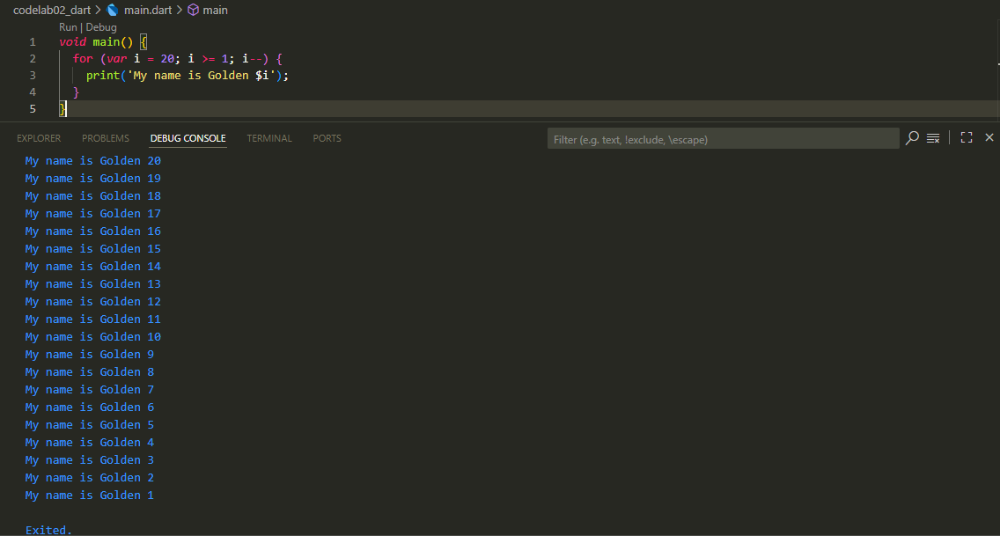
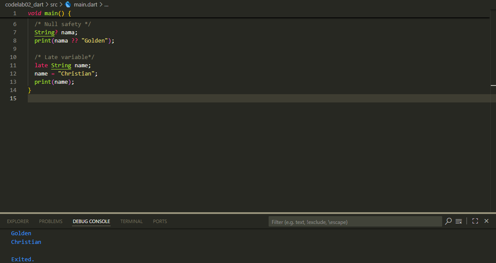

# Dart
## Pertanyaan 1 

## Pertanyaan 2
Mengapa penting untuk memahami bahasa pemrograman Dart sebelum menggunakan framework Flutter? Jelaskan!

- Flutter is built on the Dart programming language, so all logic code, data structures, and UI settings are written in Dart.

- Understand basic syntax (variables, functions, classes, OOP).

- Utilising the Null Safety feature to prevent runtime errors.

- Mengoptimalkan pemrograman asinkron (Future, async/await, Stream).

Conclusion: Mastering Dart is an important foundation before developing applications using Flutter.

## Pertanyaan 3
Ringkaslah materi dari codelab ini menjadi poin-poin penting yang dapat Anda gunakan untuk membantu proses pengembangan aplikasi seluler menggunakan kerangka kerja Flutter.

1. Dart as the core of Flutter
- All code in Flutter is written in Dart (applications, plugins, dependencies).
- Understanding Dart = more productive and convenient Flutter development.

2. History & Evolution of Dart
- Released in 2011, stable since 2013, and experiencing a major leap forward with Dart 2.0 (2018).
- Originally intended to replace JavaScript, it now focuses on Flutter.
- Modern, cross-platform, powerful, flexible, and constantly evolving.

3. How Dart Works
- JIT (Just-In-Time) → fast, suitable for debugging and hot reloading.
- AOT (Ahead-Of-Time) → high performance for release applications.
- Can be compiled to JavaScript, ARM, and x86.
- Supports hot reloading in Flutter.

4. Dart Language Structure
- Syntax similar to C/JavaScript → easy to understand for those who are already familiar with it.
- OOP (Object-Oriented Programming) → supports classes, objects, inheritance, encapsulation, abstraction, and polymorphism.
- Important operators:
- Arithmetic: +, -, *, /, ~/, %
- Relational: ==, !=, >, <, >=, <=
- Logical: &&, ||, !
- Increment/Decrement: ++, --

5. Practising with Dart
- Use DartPad (https://dartpad.dev/)
 to write and run code online.
- It can also be run locally with the command dart run.
void main() {
  for (int i = 0; i < 5; i++) {
    print(“hello ${i + 1}”);
  }
}

6. Function & Method Concepts
- Function → stands alone, for example main().
- Method → part of a class, has access to this.

## Pertanyaan 4
Buatlah penjelasan dan contoh eksekusi kode tentang perbedaan antara variabel Null Safety dan Late !

Null Safety: 
- A feature to prevent null values from appearing unexpectedly.
- Variables must be declared whether they can be null or not.

Late:
- Used to delay the initialisation of non-nullable variables until later.
- Useful when new values are available at runtime.
