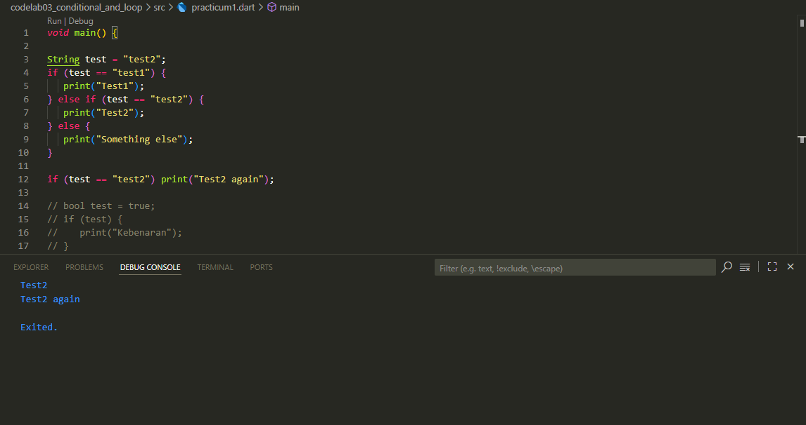
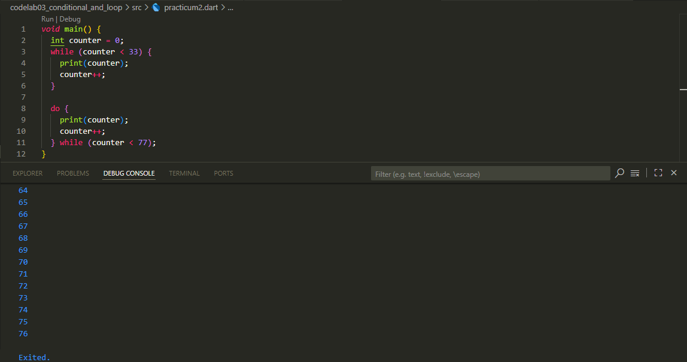
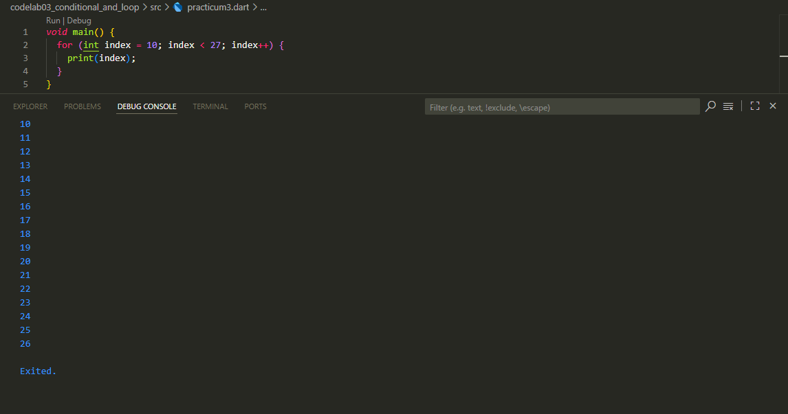
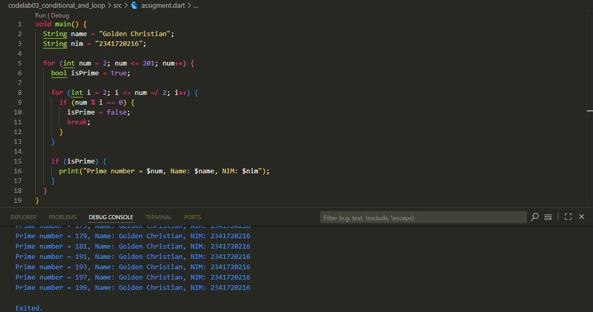

# conditional and loop
## Practicum 1 

Explanation
1. The variable test contains “test2”.
2. The condition if (test == “test1”) → false, so it does not print “Test1”.
3. The else if condition (test == “test2”) → true, so it prints:
4. After exiting the if/else block, there is an additional check:  
test 2
test again

Conclusion: The program successfully checks conditions using if/else. Only the correct condition is executed.

## Practicum 2

Explanation

1. While loop:
- Starting from counter = 0.
- The program prints 0 to 32.
- When counter == 33, the condition counter < 33 becomes false → the loop stops.
2. Do-while loop:
- Starts with counter = 33.
- do { ... } while (...) is always executed at least once.
- Prints numbers from 33 to 76.

Conclusion:
- While loops are suitable when we want to check the condition first before executing the block.
- Do-while loops are suitable when we want to execute the block at least once even if the condition may be false.

## Practicum 3

Explanation

1. Initialization: index = 10.
2. The loop runs as long as index < 27.
3. Conditions in the loop:
- if (index == 21) break; → when index = 21, the loop stops.
- else if (index > 1 && index < 7) continue; → this condition is not met because the loop starts from 10.
- print(index); → prints the value of index.

Conclusion:
- break stops the loop.
- continue skips certain iterations.
- In this case, only break works because the continue condition is never met.

## Assigment

Explanation

1. The main loop runs from 2 to 201.
2. The variable isPrime is used to mark whether num is a prime number.
3. The second loop (for (int i = 2; i <= num ~/ 2; i++)) checks whether num can be divided by other numbers.
- If there is a divisor (num % i == 0) → isPrime = false.
- If there is no divisor → the number is prime.
4. If isPrime == true, the program prints the prime number + name + student ID.

Conclusion: This program displays all prime numbers from 2 to 201, along with the student's identity (name & student ID).