# Dart part 3
## Practicum 1 
### Step 1
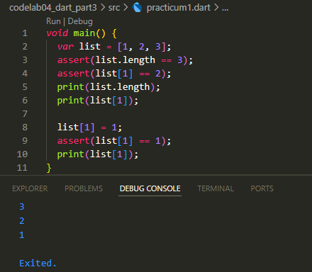

### Step 2
- var list = [1, 2, 3]; → Create a list with the contents [1, 2, 3].
- assert(list.length == 3); → Checks the length of list = 3 (true).
- assert(list[1] == 2); → Checks the element at index 1 is 2 (true).
- print(list.length); → Output: 3.
- print(list[1]); → Output: 2.
- list[1] = 1; → The 1st index element that was originally 2 is changed to 1.
- assert(list[1] == 1); → Correct check.
- print(list[1]); → Output: 1.

### Step 3
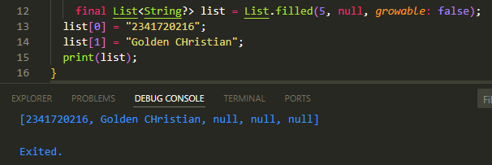
- List.filled(5, null, growable: false) → Creates a list with length 5, all initial elements are null, and cannot grow (growable: false).
- So initially list = [null, null, null, null, null, null]
- list[0] = "2341720216"; → Populates the element at index 0.
- Now list = ["2341720216", null, null, null, null]
- list[1] = "Golden Christian"; → Fills in the element at index 1.
- Now list = ["2341720216", "Golden Christian", null, null, null]
- print(list); → Will print the complete list.

## Practicum 2
### Step 1
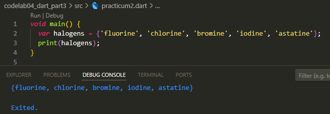

### Step 2
- You create a Set of halogen elements.
- Sets are unique collections of data (there can be no duplicate elements).
- So if you add the same element twice, only one is stored.
- print(halogens); will display the entire contents of the Set.

### Step 3
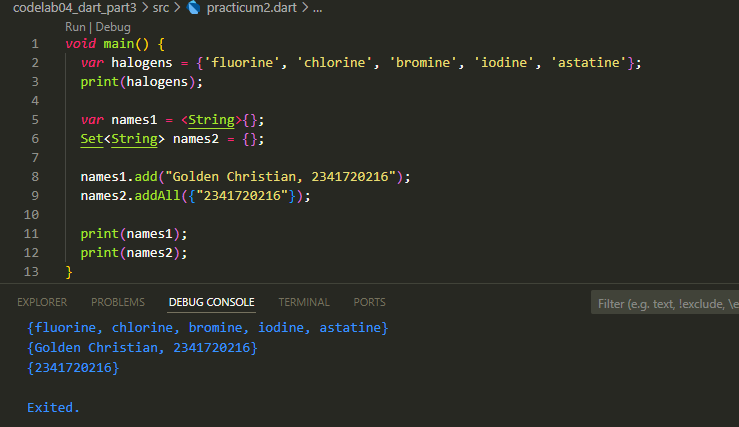
- names1 → An empty Set of type String.
- names2 → Another way of defining an empty Set.
- names3 → If using {} without type, Dart will consider it an empty Map, not a Set.
- Since the practical instruction only focuses on Set, we remove names3.
- .add() → adds one element to the Set.
- names1.add("Golden Christian, 2341720216");
- Fill names1 now: {"Golden Christian, 2341720216"}
- .addAll() → adds many elements at once to the Set (from another list/Set).
- names2.addAll({"2341720216"});
- Fill names2 now: {"2341720216"}

## Practicum 3
### Step 1
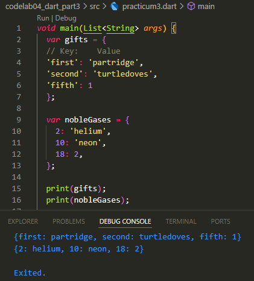

### Step 2
- A map is a data structure with key-value pairs.
- gifts uses String as key ('first', 'second', 'fifth').
- nobleGases uses int as the key (2, 10, 18).
- The value can be a mixture of data types, for example gifts['fifth'] = 1 (number).

### Step 3
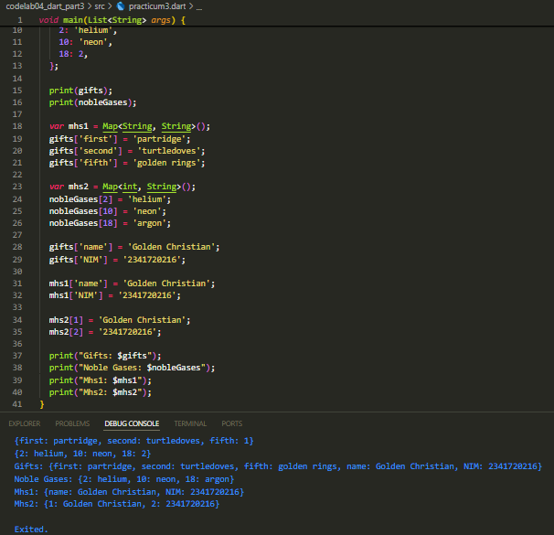
- mhs1 is an empty Map with key String, value String.
- We fill it later with name & NIM.
- mhs2 is an empty Map with key int, value String.
- Filled with student data as well.
- gifts and nobleGases are updated:
- fifth which was 1 is changed to 'golden rings'.
- nobleGases[18] which was 2 was changed to 'argon'.
- In gifts, two new entries were added (name & NIM).
- In mhs1, the same data is entered.
- In mhs2, the key is a number (1, 2) but the value is name & NIM.

## Practicum 4
### Step 1
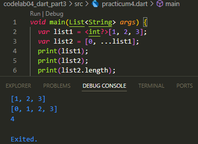

### Step 2
- ...list1 is the spread operator → spread the contents of list1 into list2.
- So:
- list1 = [1, 2, 3]
- list2 = [0, 1, 2, 3]
- Length (list2.length) = 4.

### Step 3
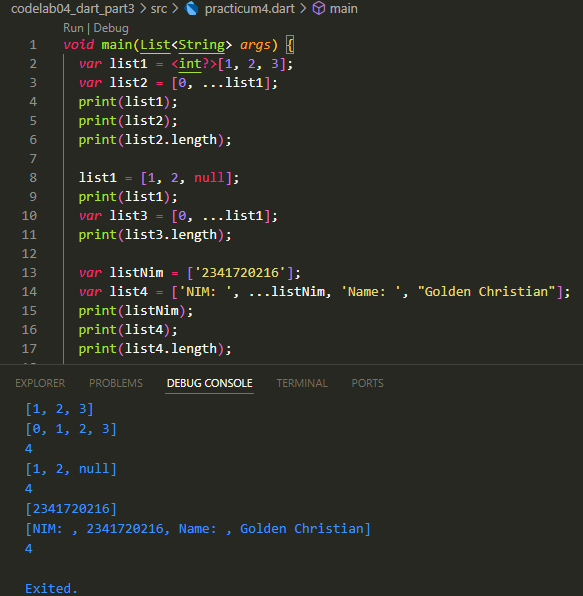
- list1 now contains a null at the last index.
- Spread ...list1 keeps spreading nulls into list3.
- list3 = [0, 1, 2, null] → length 4.

### Step 4
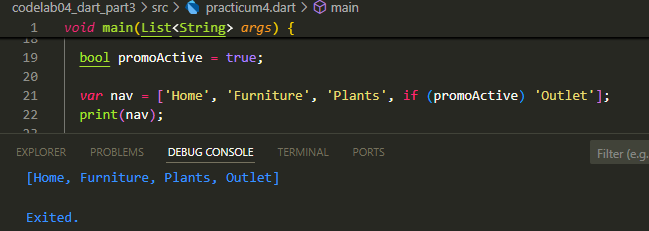
- Lists can use if to conditionally add elements.
- If promoActive = true → 'Outlet' is added to the list.
- If promoActive = false → 'Outlet' is not included.

### Step 5
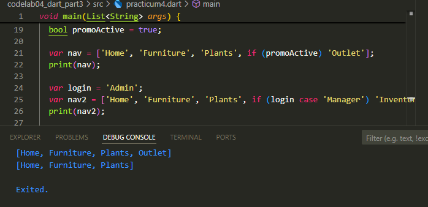
- if (login case 'Manager') → pattern matching feature in Dart.
- If login is 'Manager', then 'Inventory' is listed.
- Otherwise, it is not added.

### Step 6
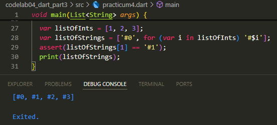
- for (var i in listOfInts) '#$i' → each element of listOfInts is used to create a new string.
- So:
- listOfInts = [1, 2, 3]
- listOfStrings = ['#0', '#1', '#2', '#3']
- assert(listOfStrings[1] == '#1') → true, no error.

## Practicum 5
### Step 1
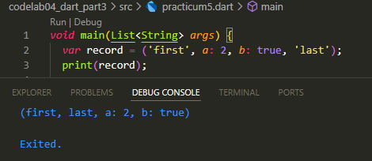

### Step 2
- record is a Record in Dart → similar to a tuple, it can have a position field and a named field.
- Here:
- Position field: 'first', 'last'
- Named field: a: 2, b: true

### Step 3
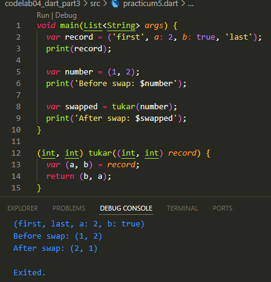
- The exchange function accepts a record containing 2 integers (int, int).
- var (a, b) = record; → destructuring record into variables a and b.
- Return (b, a) → swap their positions.

### Step 4
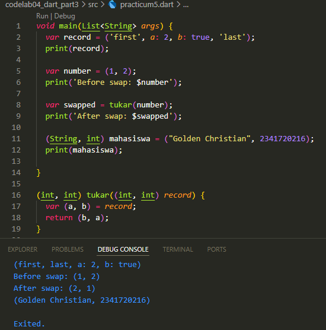
- You create a record with type (String, int).
- It contains Name + NIM.

### Step 5
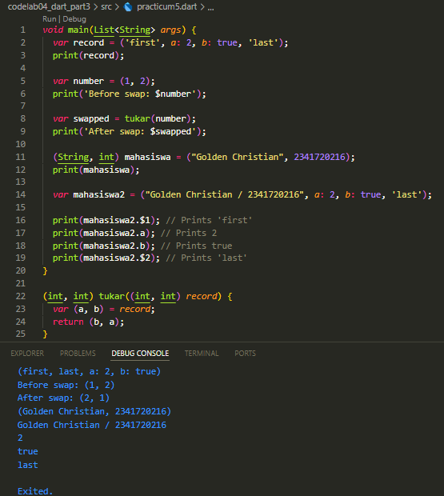
- student2 has a mix of positional fields + named fields.
- $1 → access the first positional field.
- $2 → access the second positional field.
- a, b → access the named field.

## Assigment
## 2
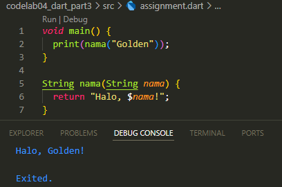
- greeting is a function with a String parameter name.
- The function returns a String (marked String before the function name).
- return returns the result string.
- main calls greet("Golden") → output: Hello, Golden!.

## 3
a. Positional Parameter
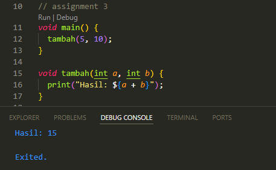
- Parameters a and b are required in order.
Output: Result: 15.

b. Optional Positional Parameter [ ]
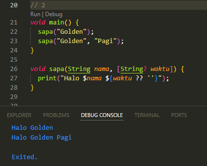
- time is written in [ ] → optional.
- If not filled, the value is null. Replace with ??'' to avoid error.
- Output:
- greet("Golden") → Hello Golden
- sapa("Golden", "Morning") → Hello Golden Morning.

c. Named Parameter { }
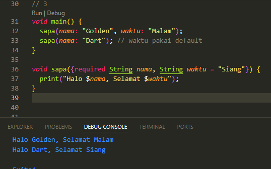
- The name parameter is marked required → mandatory.
- time has default value = "Noon".
- Output:
- greet(name: "Golden", time: "Evening") → Hello Golden, Good Evening.
- greet(name: "Dart") → Hello Dart, Good Day.

## 4
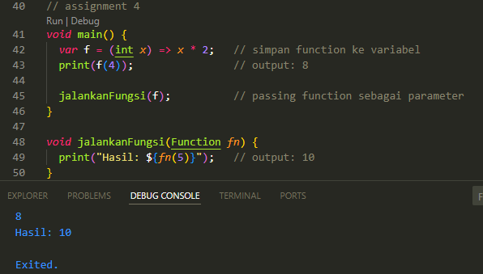
- Function(int x) => x*2 is saved to variable f.
- executeFunction accepts parameters of type Function.
- Function can be called like a normal variable.

## 5
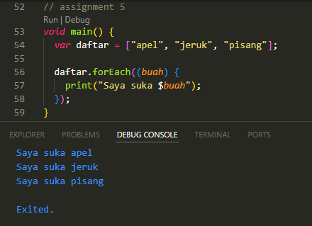
- (fruit) { print("I like $fruit"); } is an anonymous function.
- Used as a parameter to forEach.

## 6
a. Lexical Scope
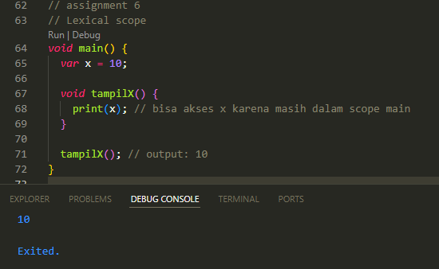
- performX can access x because it is still within the scope of play.

b. Lexical Closure
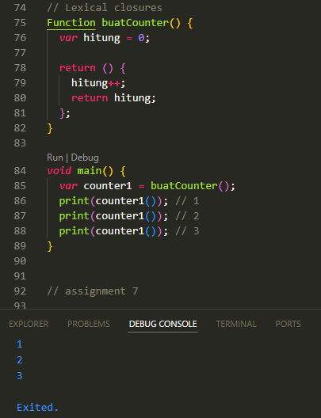
- createCounter returns a function (closure).
- Closure remembers the count variable even after the original function (createCounter) has finished.
- Each call to counter1() increments the counter value.

## 7
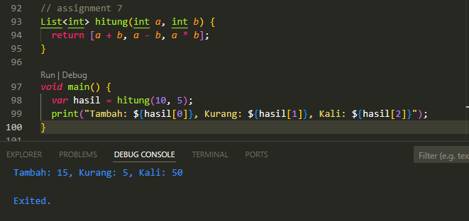
- Function returns List<int>.
- Access values with index [0], [1], [2].
