# Week 12

# Praktikum 1-5 | stream_golden

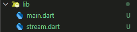
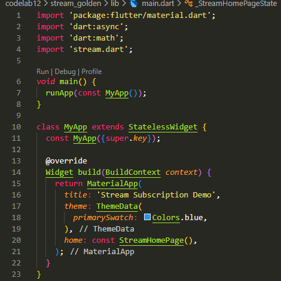
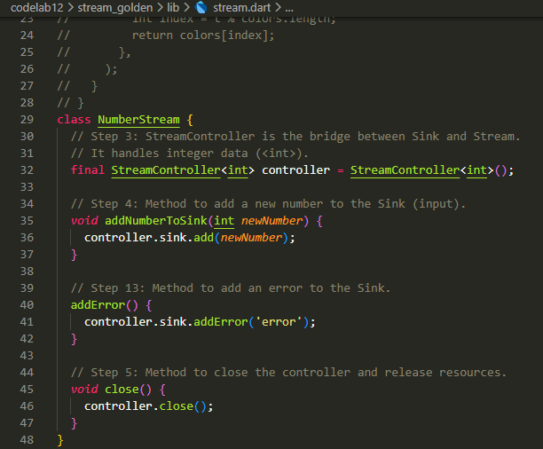
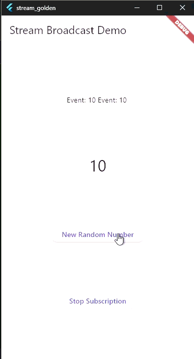

Soal 1:
- title: 'Stream Subscription Demo',

Soal 2:
- Colors.red,
- Colors.green,
- Colors.orange,
- Colors.pink,
- Colors.indigo,

Soal 3:
- Keyword yield* (yield-each) digunakan dalam sebuah fungsi generator asinkron (async*) untuk menghasilkan (mengeluarkan) semua elemen dari sebuah Stream atau Iterable lain sebagai bagian dari Stream yang sedang dibuat.
- Kode ini menghasilkan Stream warna yang berubah secara otomatis dan berulang setiap satu detik dari list colors yang tersedia.

Soal 5:
- listen() untuk mendapatkan notifikasi data baru secara terus-menerus (seperti event handler), terutama jika Anda perlu menghentikannya di kemudian hari.
- await for untuk memproses data Stream satu per satu secara berurutan seperti loop biasa, terutama jika Stream tersebut akan segera berakhir.

Soal 6:
- kode langkah 8 | Langkah 8 berfungsi sebagai konsumen data Stream, memastikan bahwa UI diperbarui secara reaktif setiap kali ada angka acak baru yang dimasukkan ke dalam StreamController.
- kode langkah 10 | Langkah 10 berfungsi sebagai produsen data Stream, yang bertanggung jawab untuk memasukkan angka acak ke dalam Stream, sehingga dapat diterima oleh listener (yang diatur pada Langkah 8).

Soal 7:
- kode langkah 13 | Ketika addErrorToSink() dipanggil, Stream akan berhenti mengirimkan data biasa (event) dan malah mengirimkan notifikasi error kepada semua listener yang sedang mendengarkan.
- kode langkah 14 | Di dalam callback ini, UI dapat merespons kesalahan, misalnya dengan mengatur lastNumber = -1 dan menampilkan pesan error kepada pengguna melalui SnackBar. Tanpa penanganan ini, error akan dilempar dan mungkin menyebabkan aplikasi crash atau Stream terhenti.
- kode langkah 15 | 
- Jika Genap (myNum.isEven): Stream akan diinjeksi dengan sinyal error melalui numberStream.addErrorToSink(). Hal ini akan memicu callback onError (Langkah 14), dan pesan error akan muncul di SnackBar.
- Jika Ganjil: Stream akan diinjeksi dengan data normal melalui numberStream.addNumberToSink(myNum). Hal ini akan memicu callback data utama (Langkah 14) dan memperbarui lastNumber di UI.

Soal 8:
- kode langkah 1 | Variabel ini akan menampung logika transformasi yang akan mengubah data bertipe int yang masuk (<int, ...>) menjadi data bertipe int yang keluar (<..., int>). Tipe ini digunakan untuk mempermudah injeksi (penyisipan) logika transformasi ke dalam Stream.
- kode langkah 2 | Menginisialisasi variabel streamTransformer dengan logika mapping kustom.
- kode langkah 3 | Menggunakan metode transform() untuk menyisipkan (inject) logika transformasi ke dalam rantai Stream sebelum data mencapai listener.

Soal 9:
- kode langkah 2 | Dengan menyimpan StreamSubscription, kita mendapatkan kemampuan untuk mengontrol aliran data dari luar listener, seperti menghentikan (cancel()) atau menjeda (pause()) langganan secara eksplisit, yang merupakan praktik baik (best practice) dalam manajemen sumber daya.
- kode langkah 6 | Membatalkan langganan Stream di dispose() adalah praktik terbaik wajib saat bekerja dengan Stream yang berjalan lama (seperti periodic stream atau stream dari StreamController yang dibuat di luar widget).
- kode langkah 8 | Kode ini memastikan bahwa tombol 'Tambah Angka' hanya akan mengirimkan data ke StreamController (addNumberToSink) jika dan hanya jika langganan Stream (konsumen) sedang tidak dijeda.

Soal 10:
- Error yang Anda lihat (biasanya Bad State: Stream has already been listened to) terjadi karena secara default, Stream yang dibuat oleh StreamController adalah Single-Subscription Stream.

Soal 11:
- Ketika tombol 'New Random Number' ditekan, data angka acak dikirimkan ke StreamController. Karena Stream sekarang bersifat broadcast, kedua listener (subscription dan secondSubscription) menerima data yang sama persis secara simultan, menyebabkan kedua state (lastNumber dan lastNumber2) diperbarui dengan nilai yang sama, dan Text tampil dua kali dengan angka yang sama.

# Praktikum 6 | streambuilder_golden

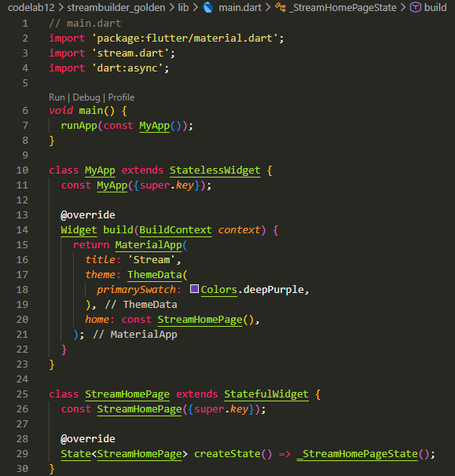
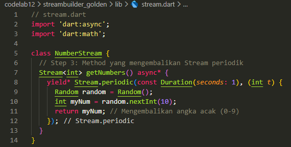
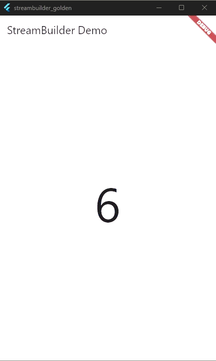

Soal 12:
- kode langkah 3 | Kode ini berfungsi sebagai produsen data Stream yang secara periodik (berkala) menghasilkan urutan bilangan bulat yang terus meningkat.
- kode langkah 7 | Menggunakan Widget StreamBuilder untuk secara reaktif membangun ulang (rebuild) UI setiap kali ada data baru yang masuk dari Stream.

# Praktikum 7 | bloc_random_golden

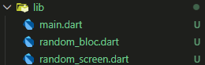
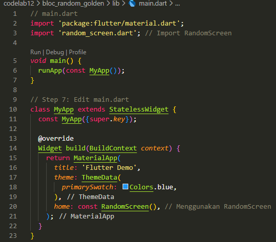
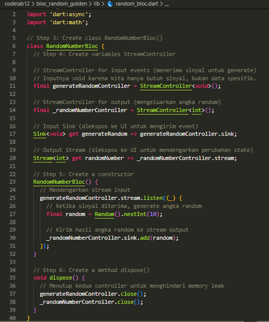
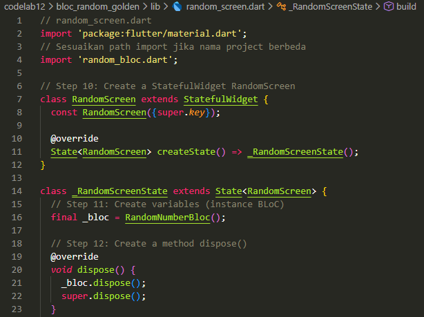
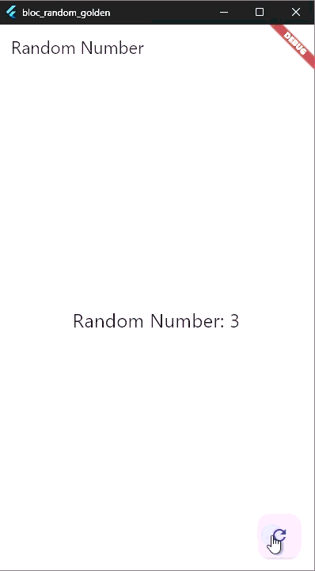

Soal 13:
- Segalanya Adalah Stream: UI mengirimkan event ke BLoC melalui bloc.sink, dan UI menerima state baru dari BLoC melalui bloc.stream.
- Pemisahan Lengkap: Widget RandomScreen tidak tahu bagaimana angka acak dihasilkan; ia hanya tahu cara mengirim sinyal permintaan dan cara menampilkan data yang masuk. Logika Random().nextInt(10) sepenuhnya terisolasi dalam RandomNumberBloc.
- Manajemen Siklus Hidup: BLoC diinisialisasi di initState() dan dibersihkan (dispose()) di widget dispose(), memastikan Streams ditutup, yang merupakan best practice BLoC untuk menghindari memory leaks.