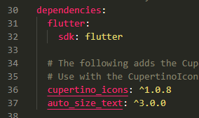
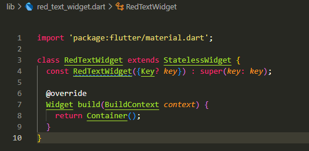
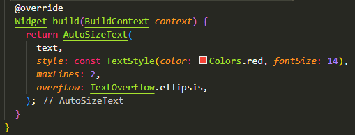
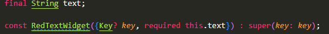
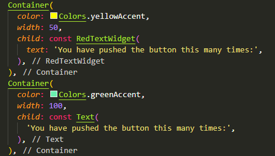
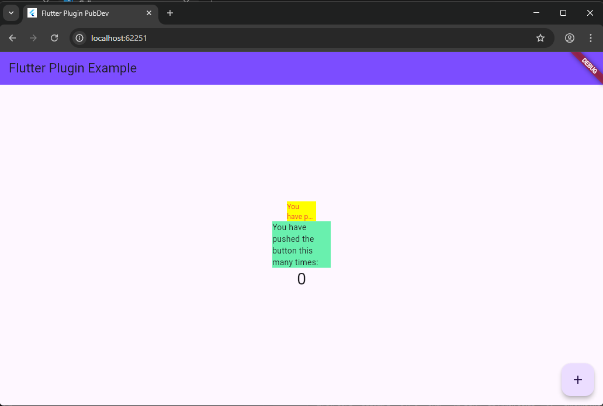

# flutter_plugin_pubdev

Step 2:
The flutter pub add auto_size_text command:
- Adds the auto_size_text dependency to the pubspec.yaml file in the dependencies section.
- Runs flutter pub get automatically to download the package and make it available in your project.
- Once successful, you will see the package name and version in pubspec.yaml and can import the package in your code.
To summarize: this command registers and downloads third-party libraries so you can use AutoSizeText in your app. 

Step 3: 
- By adding final String text; and const RedTextWidget({Key? key, required this.text}) : super(key: key); you make the widget reusable and parametric - meaning that the displayed text can be filled in from outside when calling the widget, rather than hardcoded inside the widget.
- final ensures the text value doesn't change after construction (as per the immutable widget pattern).
- required ensures the caller must pass in the text value when creating the RedTextWidget.
- Making it a const constructor (whenever possible) helps Flutter perform compile-time optimizations for constant widgets, reducing unnecessary rebuilds when values are truly constant.

Step 4:

Function of each:
- RedTextWidget = custom widget that uses AutoSizeText. It displays red text that will automatically scale down to fit within the borders (e.g. width: 50) until the minFontSize value (or according to presetFontSizes) is reached or until maxLines. If the text still doesn't fit, the next behavior depends on the overflow or overflowReplacement parameters.
- Text = Flutter's built-in Text widget - does not automatically resize the font to match the width/height of the parent. If there is not enough space, the text may be truncated, overflow, or throw a warning (depending on softWrap, overflow, etc settings).

Step 5:
1. style
- Just like in Text, it is used to set TextStyle (initial fontSize, color, fontWeight, etc). AutoSizeText uses style.fontSize as the initial size reference before shrinking.
- Example: style: TextStyle(fontSize: 20).
2. maxLines
- The limit on the number of lines allowed. AutoSizeText takes maxLines into account when adjusting the font size. If maxLines is not limited, the autosize effect may not take effect as expected.
- Example: maxLines: 2.
3. minFontSize dan maxFontSize
- minFontSize: the smallest font size that can be used during autoscaling. If the text still does not fit after reaching minFontSize, then overflow behavior applies. The default minFontSize is usually 12 (version dependent).
- maxFontSize: upper limit of font size (useful if style.fontSize is inherited and you want to limit it).
- Example: minFontSize: 12.
4. stepGranularity
- When AutoSizeText tries to shrink the font, it decreases the size by the stepGranularity step. This value should not be too small (1 or more is recommended) for good performance.
- Example: stepGranularity: 1.
5. presetFontSizes
- Alternative to minFontSize/stepGranularity. If you only want to allow certain font sizes, provide a list of sizes. If set, the minFontSize, maxFontSize, and stepGranularity settings are ignored.
- Example: presetFontSizes: [40, 30, 20, 14].
6. overflow
- Same as in Text: describes how to display text that does not fit (e.g. TextOverflow.ellipsis, TextOverflow.clip). But ideally AutoSizeText avoids overflow by shrinking the font. If it still does not fit (up to minFontSize), then overflow will be applied.
- Example: overflow: TextOverflow.ellipsis.
7. overflowReplacement
- If the text remains overflowed after autoscaling, you can display a replacement widget (e.g. a short message) instead of the very small or overflowed text.
- Example: overflowReplacement: Text('Too long').
8. presetFontSizes vs stepGranularity
- presetFontSizes = use only sizes from the list (more deterministic).
- stepGranularity = decrease the size gradually (e.g. 1.0) from style.fontSize to minFontSize.
9. AutoSizeGroup (parameter group)
- AutoSizeGroup is a controller/sink to synchronize the font sizes of multiple AutoSizeTexts so that all texts in the group will use the same final size. Keep the group instance in StatefulWidget so that it is not recreated every build.
10. AutoSizeText.rich(...)
- Version for rich text (TextSpan), similar to Text.rich. Note: reference font size calculation still uses style.fontSize from AutoSizeText/inherited style.