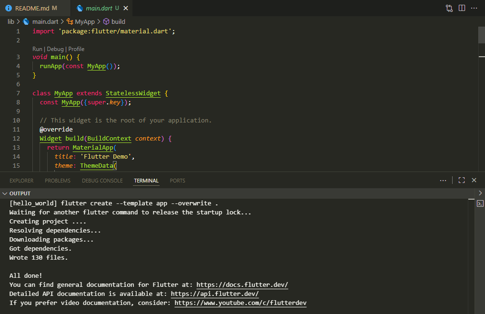
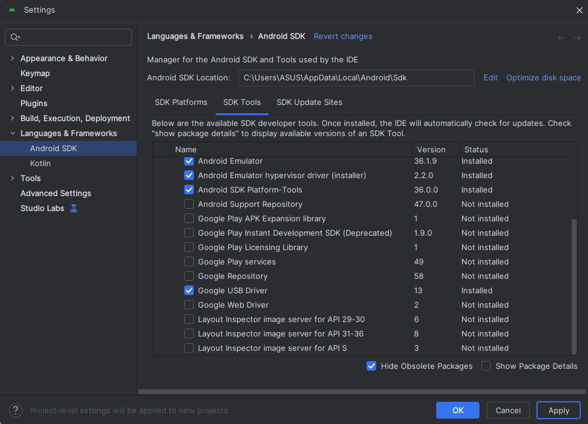
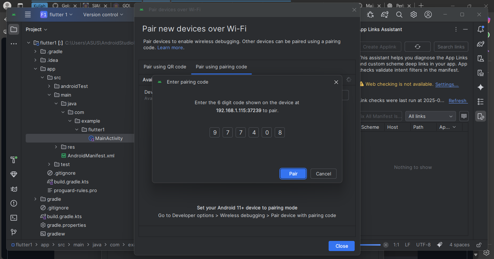
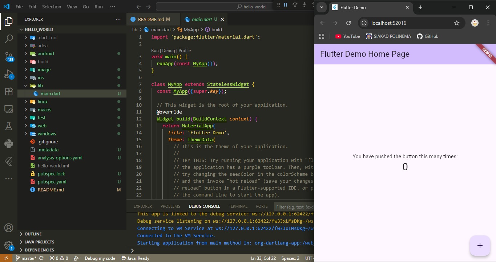
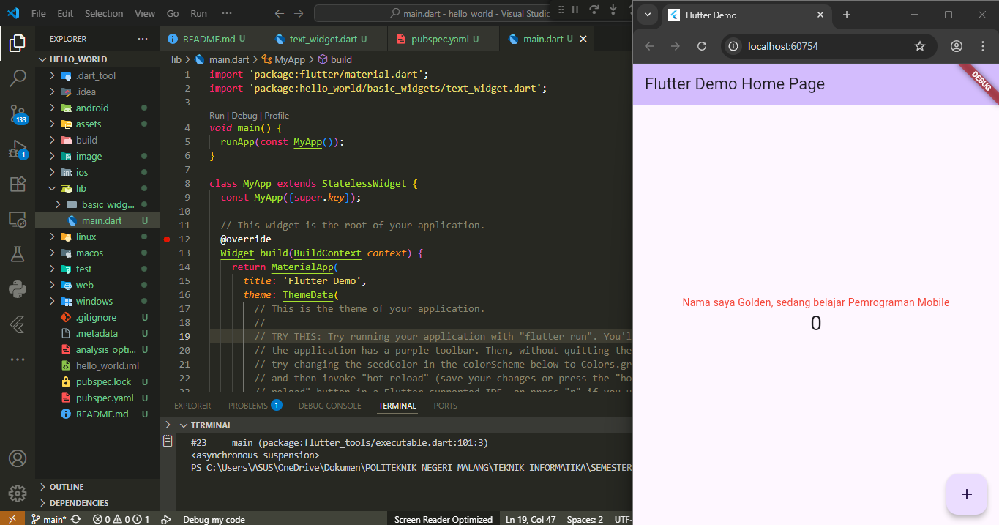
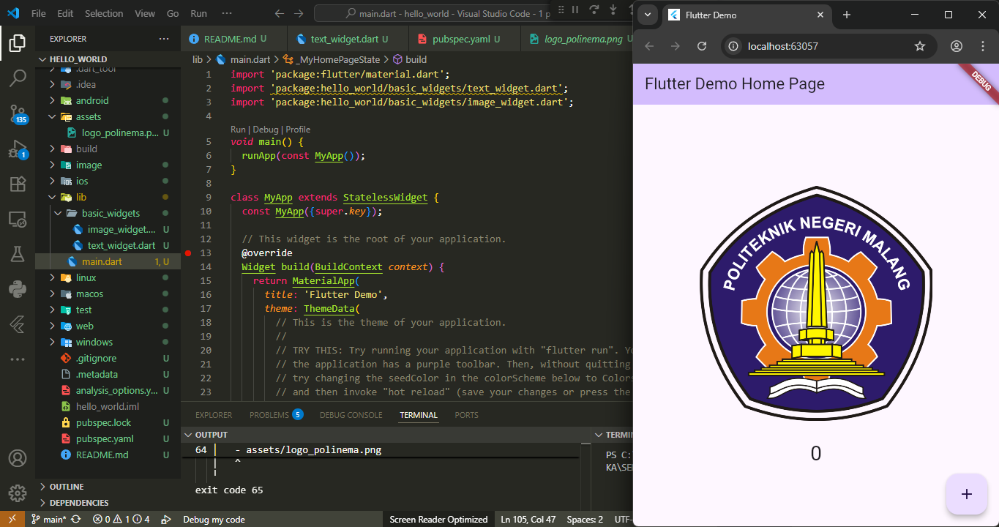
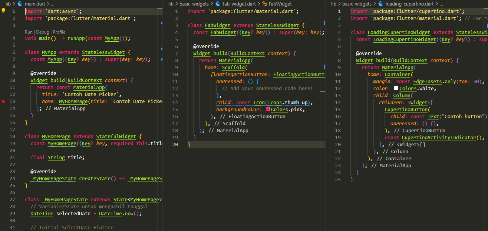
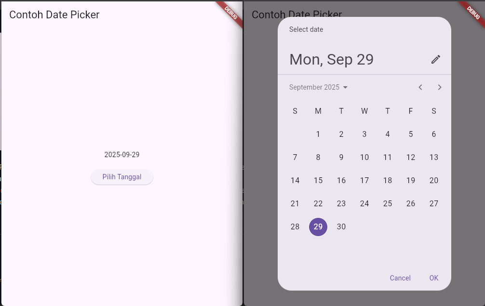

# Tugas Praktikum
## No. 1 Selesaikan Praktikum 1 sampai 5, lalu dokumentasikan dan push ke repository Anda berupa screenshot setiap hasil pekerjaan beserta penjelasannya di file README.md!
### Praktikum 1: Membuat Project Flutter Baru

1. Open the Command Palette in VS Code
Use the Ctrl + Shift + P shortcut or the View > Command Palette menu, then type Flutter: New Application Project to start project creation.
2. Select the Project Location Folder
Specify the location of the folder where the project will be created (recommended on the Desktop or Documents for easy access).
3. Name the Project
Type the project name, for example hello_world. The name must be all lowercase, no spaces, and if more than one word use underscore.
4. Wait for the Creation Process to Finish
After the process is complete, the message "Your Flutter Project is ready!" will appear, indicating that the project was successfully created.
### Praktikum 2: Menghubungkan Perangkat Android atau Emulator

### Praktikum 3: Membuat Repository GitHub dan Laporan Praktikum

- Create a GitHub repository to store Flutter projects.
- Perform Git initialization, commit, push, and synchronize the project to GitHub.
- Make a practicum report in the form of screenshots of running application results.
### Praktikum 4: Menerapkan Widget Dasar

Text Widget
Used to display text on the screen with a specific style. In this exercise, the text contains your full name with a red color, font size 14, and center-aligned position.

Image Widget
Used to display images. The image file (e.g. logo_polinema.jpg) is stored in the assets/ folder, and then registered in pubspec.yaml so that it can be called into the application.
### Praktikum 5: Menerapkan Widget Material Design dan iOS Cupertino

## No. 2 Selesaikan Praktikum 2 dan Anda wajib menjalankan aplikasi hello_world pada perangkat fisik (device Android/iOS) agar Anda mempunyai pengalaman untuk menghubungkan ke perangkat fisik. Capture hasil aplikasi di perangkat, lalu buatlah laporan praktikum pada file README.md.

## No. 3 Pada praktikum 5 mulai dari Langkah 3 sampai 6, buatlah file widget tersendiri di folder basic_widgets, kemudian pada file main.dart cukup melakukan import widget sesuai masing-masing langkah tersebut!

## No. 4 Selesaikan Codelabs: Your first Flutter app, lalu buatlah laporan praktikumnya dan push ke repository GitHub Anda!

## No. 5 README.md berisi: capture hasil akhir tiap praktikum (side-by-side, bisa juga berupa file GIF agar terlihat proses perubahan ketika ada aksi dari pengguna) dengan menampilkan NIM dan Nama Anda sebagai ciri pekerjaan Anda.