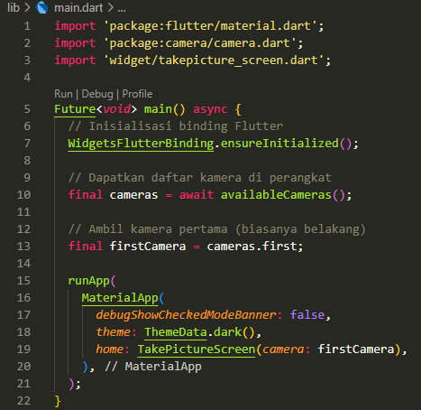
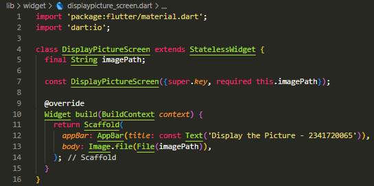
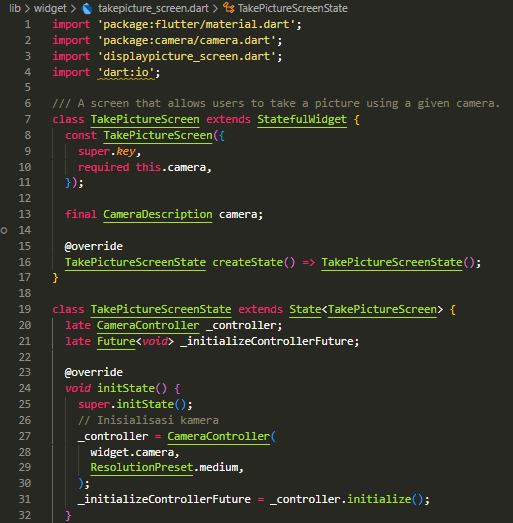
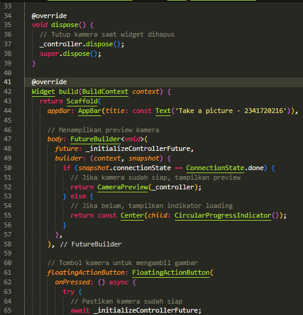
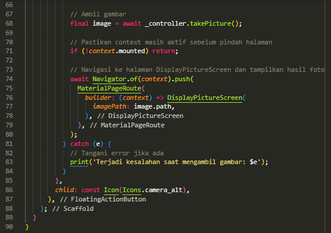
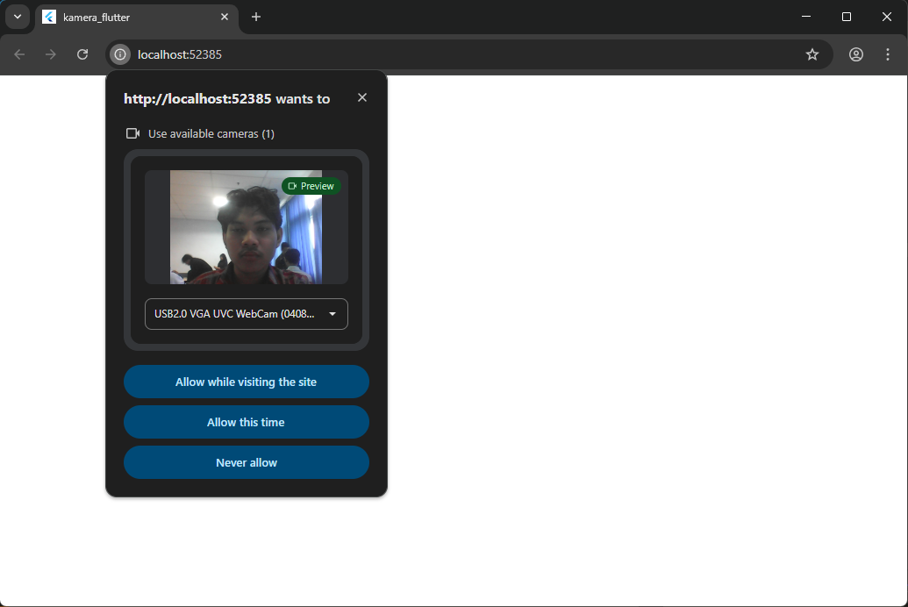

# kamera_flutter

main.dart

widget|displaypicture_scrren.dart

widget|takepicture_screen.dart

result:

The void async in Practical 1 is to define the main() function as an asynchronous function that does not return a value (return type void).
1. void
- In Flutter/Dart, void indicates that the function does not return a value after its execution is complete.
- The main() function itself is traditionally the first function to be executed and does not return a value.
2. async
- The keyword async (short for asynchronous) is placed after the return type (void) to indicate that this function will contain time-consuming operations and will be executed asynchronously.
- Asynchronous functions allow the program to continue executing other tasks without having to wait for slow operations (such as I/O, networking, or in this case, camera initialization) to complete. This is important in order to keep the user interface (UI) responsive.

Using void async (or Future<void> async) in mai () allows initialization code that depends on slow I/O operations (such as getting a list of cameras using await availableCameras()) to be completed before the main application starts, while maintaining the structure of the main() function that does not return a value.
