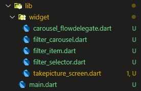
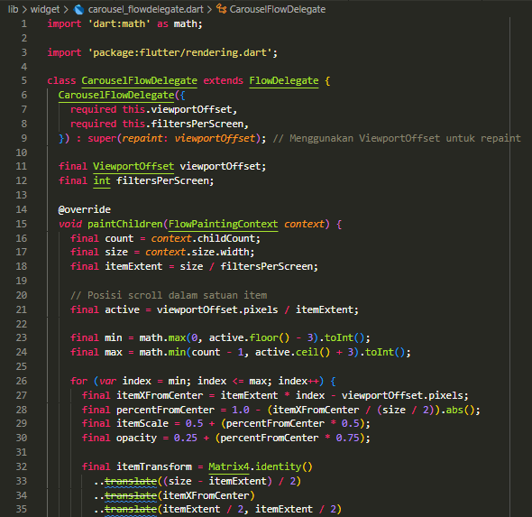
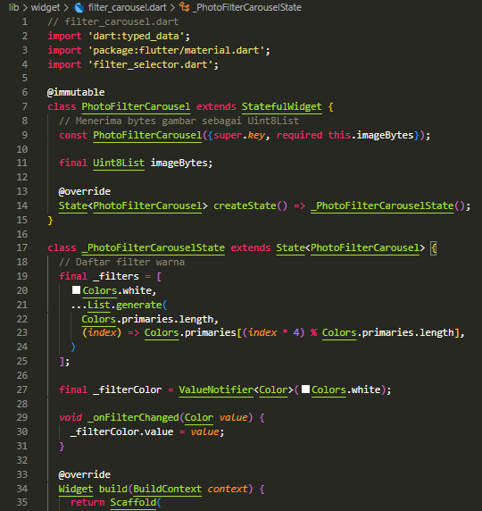
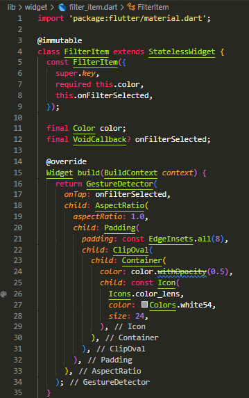
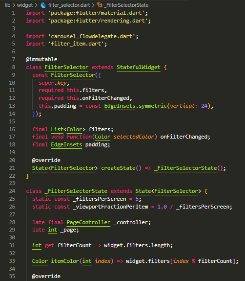
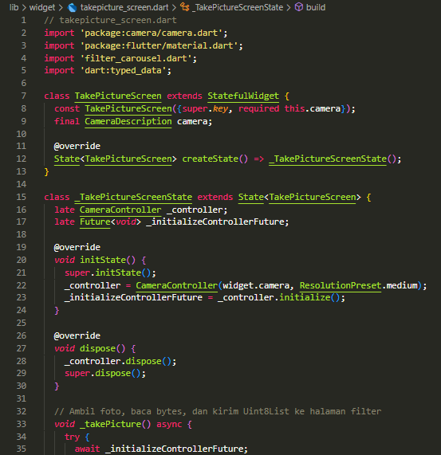
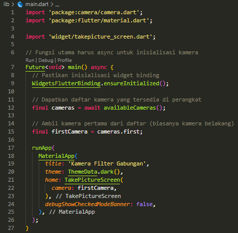
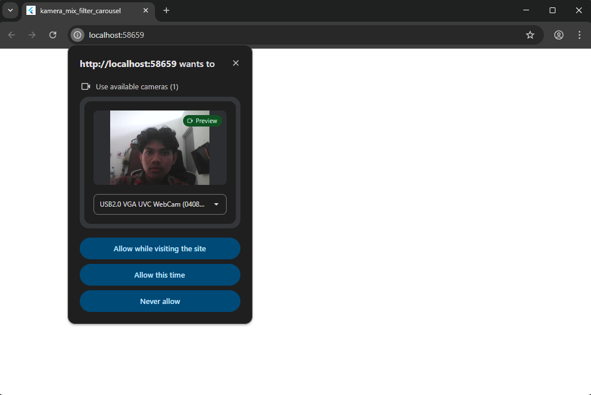
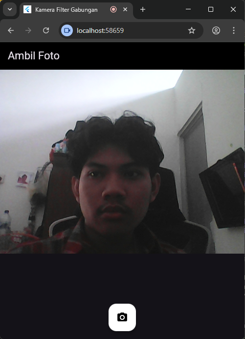
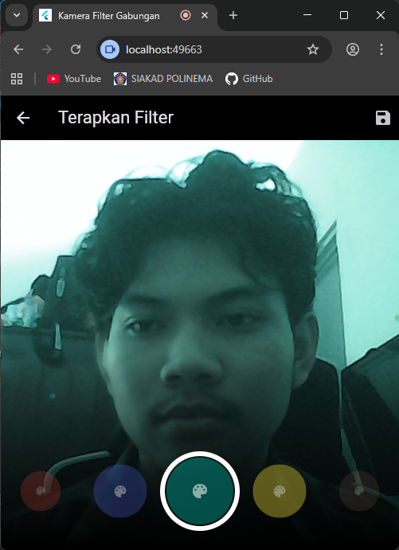

# kamera_mix_filter_carousel

## Tugas Praktikum
2. Combine the results of practical work 1 with the results of practical work 2 so that after taking photos, you can create a carousel filter!

lib

widget

main

result:

