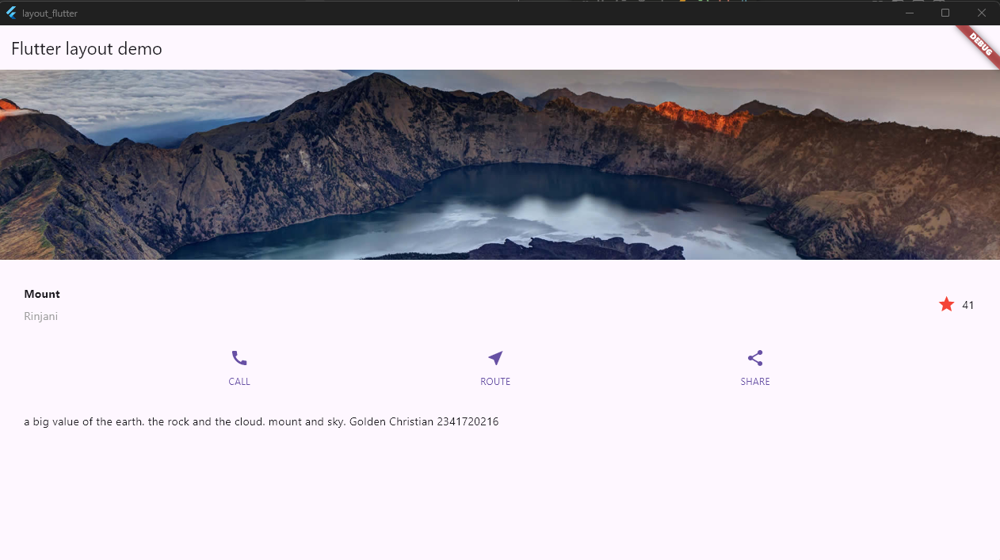

# Assignment 1

## Praktikum 1

## Praktikum 2

## Praktikum 3

## Praktikum 4

The Flutter code creates an app with a simple layout that displays an image of Mount Rinjani, a title, a rating icon, three action buttons (CALL, ROUTE, SHARE), and a text description. The application starts from the main() function that runs the main MyApp widget, and then inside it uses MaterialApp and Scaffold as the basic framework of the display. The main layout components consist of a titleSection for displaying text and star icons, a buttonSection for a row of three buttons built with the _buildButtonColumn() function, and a textSection for displaying descriptive paragraphs. All elements are displayed in a ListView to make them scrollable, and the image element above them is arranged to fill the screen width with BoxFit.cover. Overall, this code shows how to organize widgets vertically and horizontally in a single Flutter page using a neat, layered layout structure.

## Result:
Praktikum 4
