# master_plan

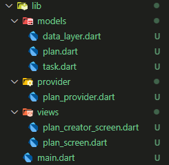

## Practicum 1

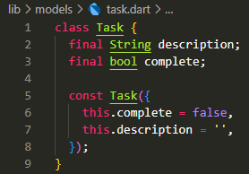
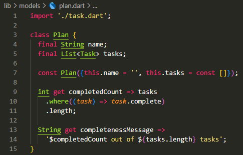
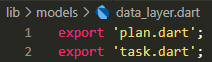

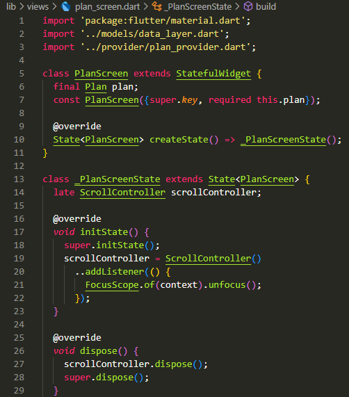
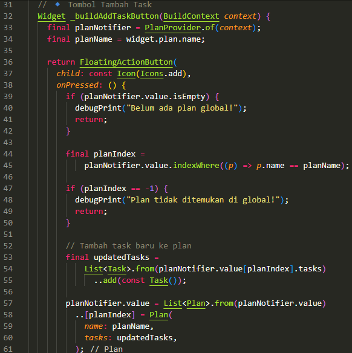
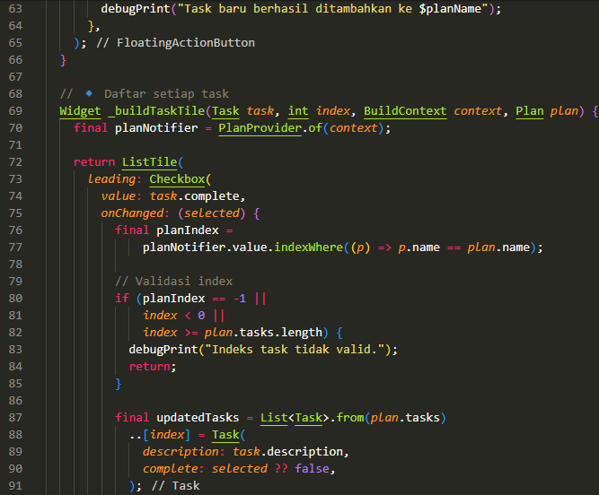
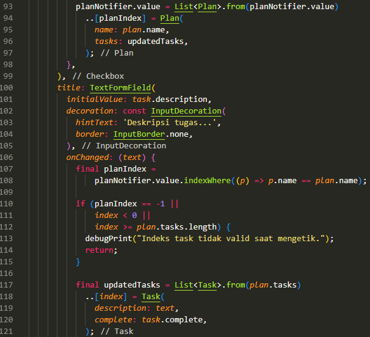
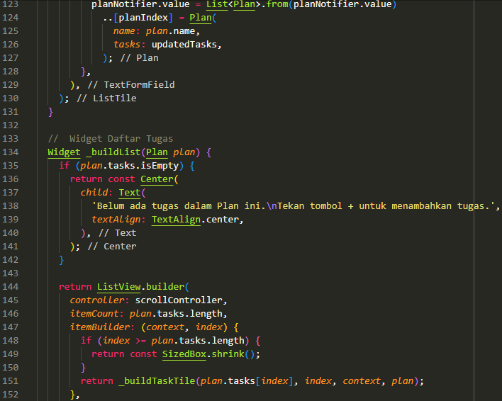
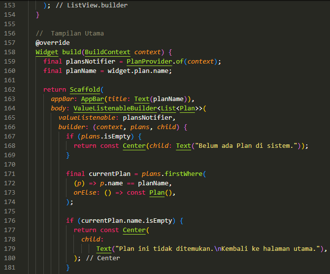
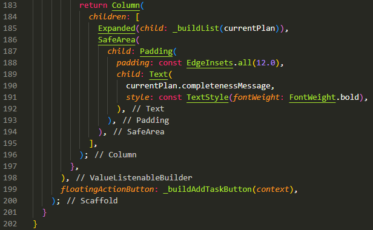
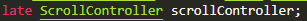

Assignment: 

2. Explain the purpose of step 4 in the lab! Why is it done that way?
- Import Simplification: By exporting both models from a single file, other widgets (such as PlanScreen) only need to import once (import '../models/data_layer.dart';) to access all data models (Task and Plan).
- Scalability: If the application grows and the number of models increases (user.dart, project.dart, etc.), this data layer file can be updated to export new models.

3. Why is the plan variable necessary in step 6 of the practical exercise? Why is it made a constant?
- plan: _PlanScreenState is a State class from StatefulWidget. Any data that changes and needs to trigger a redraw (rebuilding of the display) is placed in the State class.
- const Plan(): The Plan and Task classes are defined with the final keyword on all their properties. This means that the objects are immutable (cannot be changed) once they are created.

4. Capture the results of Step 9 as a GIF, then explain what you have created!
- Capture the results of the application after Step 9 (before adding ScrollController) as a GIF. In this step, you can add, check, and edit tasks.

5. What is the purpose of the methods in Steps 11 and 13 in the lifecycle state?
- initState() (Step 11): Used to initialize scrollController and register addListener to detect scroll events (making the keyboard disappear when scrolling).
- dispose() (Step 13): Used to call scrollController.dispose(), release allocated resources, and clean up listeners to prevent memory leaks.

## Practicum 2

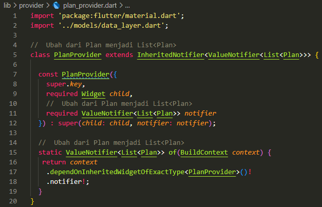

Assignment: 

2. Explain what InheritedWidget means in step 1! Why is InheritedNotifier used?
- Traditional InheritedWidget only serves to provide data to the widgets below it. However, it does not automatically notify the child widgets when the data changes, unless the child widgets call dependOnInheritedWidgetOfExactType and the parent widget (which provides the data) calls notifyListeners() or similar.

3. Explain the purpose of the method in step 3 of the practical exercise! Why is it done this way?
- completedCount: Counts the number of tasks that have been marked as complete (task.complete == true) from the list of tasks.
- completenessMessage: Creates an informative string about the progress of the plan ("[number completed] out of [total number] tasks").
- Keeping the View Clean
- Reusability
- Immutability Compliance

4. Capture the result of Step 9 as a GIF, then explain what you have created!
- ValueListenableBuilder<Plan>: This widget is the key to connecting the View with the Data Layer. It listens for changes to ValueNotifier<Plan> provided by PlanProvider.of(context).
- Selective Updates: When planNotifier.value is updated in Step 5 or 6, ValueListenableBuilder will only execute the builder function within it and rebuild its child widget (Column), not the entire PlanScreen.

## Practicum 3

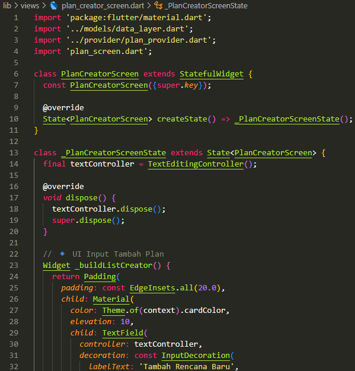
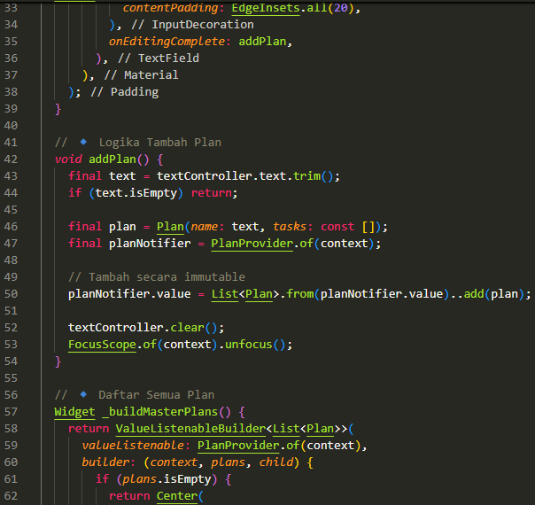
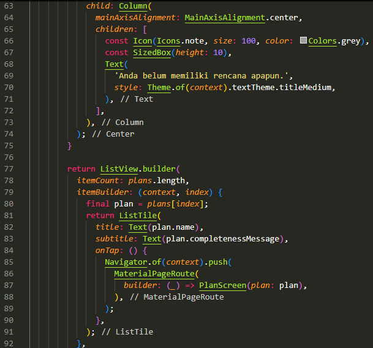

Assignment:

2. Based on Practicum 3 that you have done, explain the meaning of the following diagram!
- Left (Before Navigation): Shows the widget tree on the initial screen (PlanCreatorScreen).
- "Navigator Push": Represents the navigation process from PlanCreatorScreen to PlanScreen.
- Right (After Navigation): Shows the new widget tree after PlanScreen is displayed.

3. Capture the result of Step 14 as a GIF, then explain what you have created!
- The _buildMasterPlans() widget is the key widget responsible for displaying the list of existing plans and directing users to the details screen.
- Access Global State: This widget accesses the global state (List<Plan> plans) from PlanProvider.of(context)
- Conditional View: If the list of plans is empty, it displays a user-friendly placeholder message ('You don't have any plans yet.').
- ListView Builder: If there are plans, it uses ListView.builder to display each Plan object as a ListTile.
- Progress Details: The title displays plan.name and the subtitle displays plan.completenessMessage (calculated in the Model from Lab 2), providing a preview of the plan's progress.
- Cross-Screen Navigation: When the user taps (onTap) ListTile, it uses Navigator.of(context).push() to navigate to the PlanScreen screen, while passing the selected plan object as a parameter to the PlanScreen constructor.

Result: 

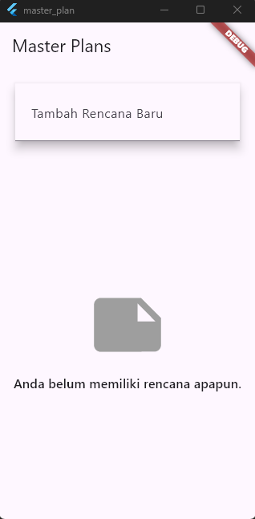
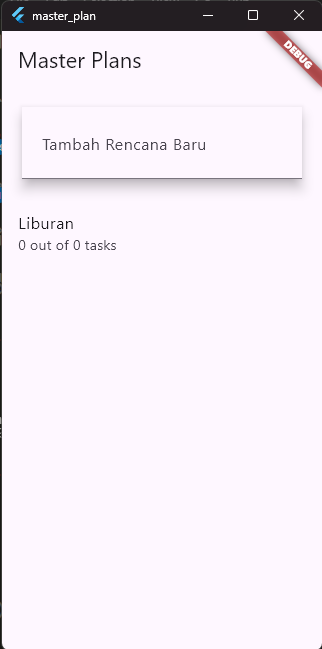
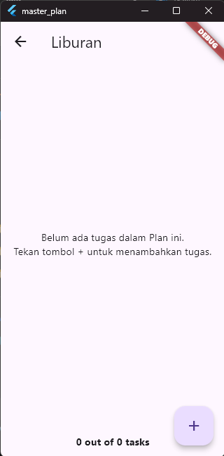
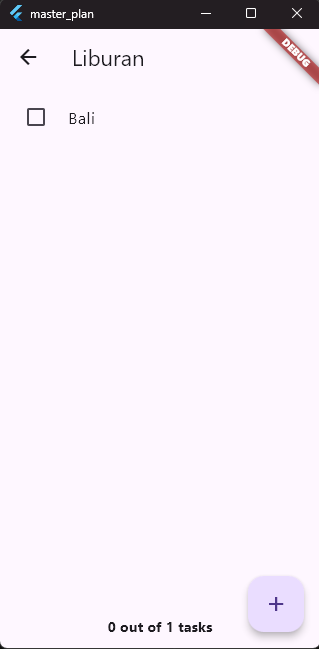
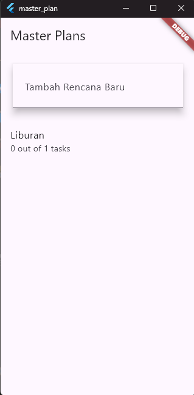
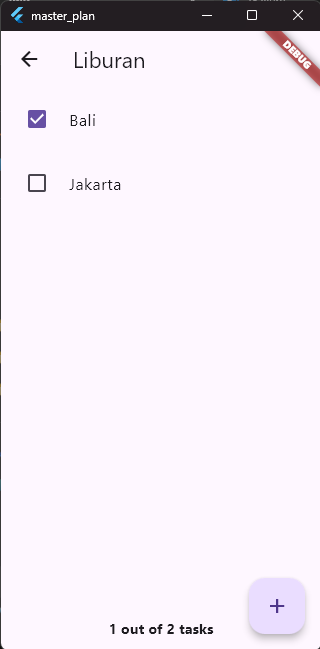

GIF

