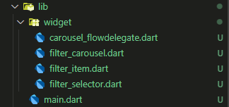
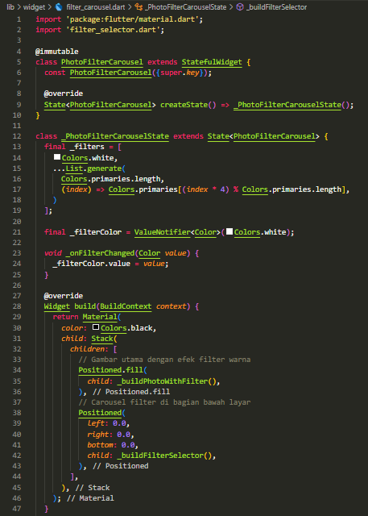
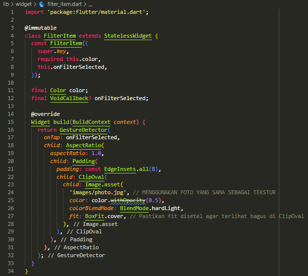
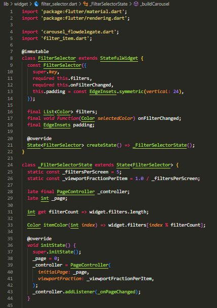
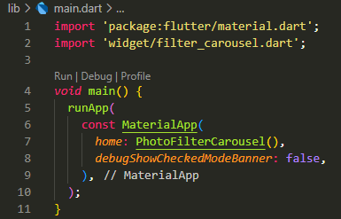

# photo_filter_corousel
## Practicum 2: Creating a photo filter carousel

lib

widget

main

result:

4. Explain the functions of the @immutable and @override annotations.

@immutable comes from the meta package in Dart. Its function is to indicate to developers and code analysis tools that the widget (or class) and all its subclasses must not have properties that can be changed after construction.

@override is a built-in annotation in the Dart language that is used to explicitly indicate that a method (or getter/setter) in a subclass (child class) overrides the implementation of a method with the same name that comes from the superclass (parent class) or the interface it implements.